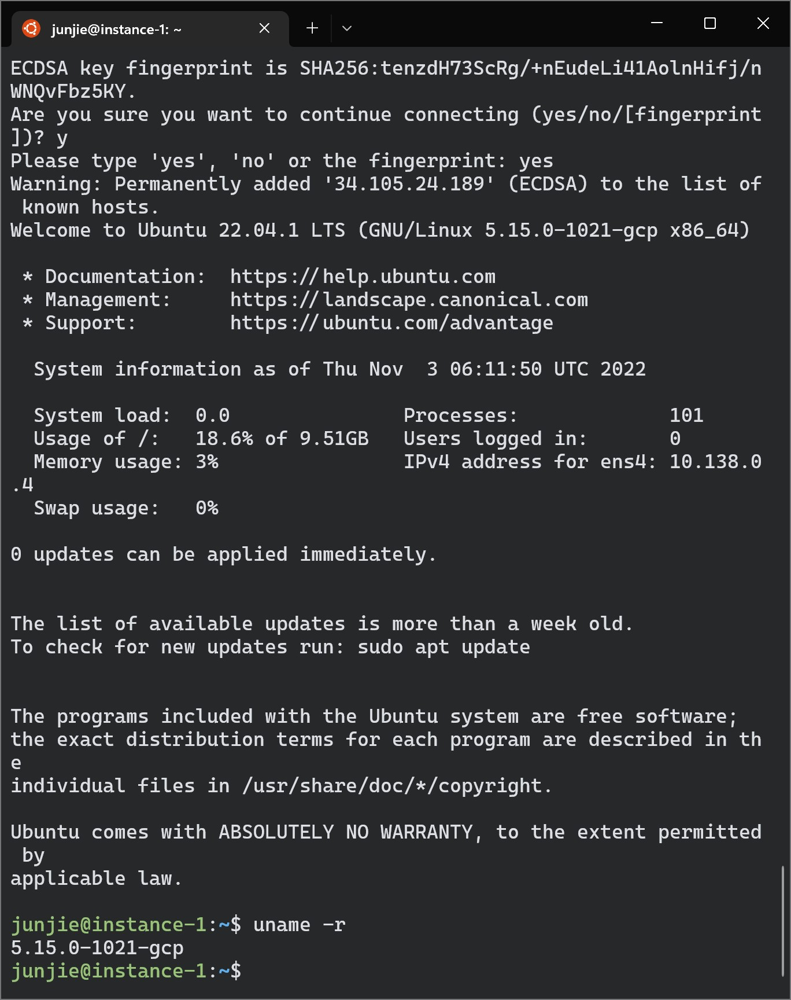
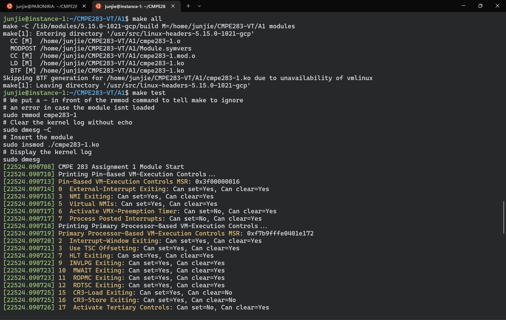
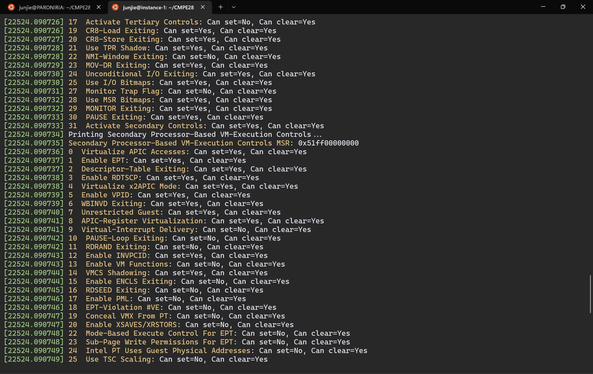
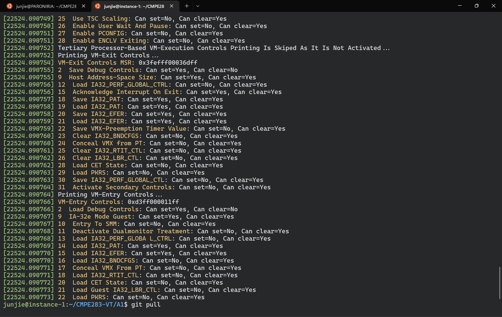

### Assignment 1: Discovering VMX Features

This assignment (A1) is to create a Linux kernel module that will query various MSRs to determine virtualization features available in your CPU. This module will report (via the system message log) the features it discovers.

At a high level, you will need to perform the following:

* Configure a Linux machine, either VM based or on real hardware. (You may use any Linux distribution you wish, but I prefer Ubuntu 22.04 LTS)

* Download and build the Linux kernel source code

* Create a new kernel module with the assignment functionality

* Load (insert) the new module

* Verify proper output in the system message log

Note: The assignment 1 instructions are specific to Intel brand CPUs. If you are using an AMD brand CPU (or another type of CPU such as an ARM64 or Apple M1/M2), you will need to do this assignment in Google Cloud (GCP).

Refer to [A1 Instruction](source/283_Assignment1-F22.pdf) for detailed info and instructions in this assignment, and refer to my [A1 log-book](A1-log-book.txt) if you are blocked and needed help.

### A1 Result Demenstration
(check out [A1 screenshots](screenshots/) for more)

SSH-to-GCP-VM-Instance

MSRs-Query-Result (Pin-Based VM-Execution and Primary Processor-Based VM-Execution)

MSRs-Query-Result (Primary Processor-Based VM-Execution and Secondary Processor-Based VM-Execution)

MSRs-Query-Result (VM-Exit and VM-Entry)
