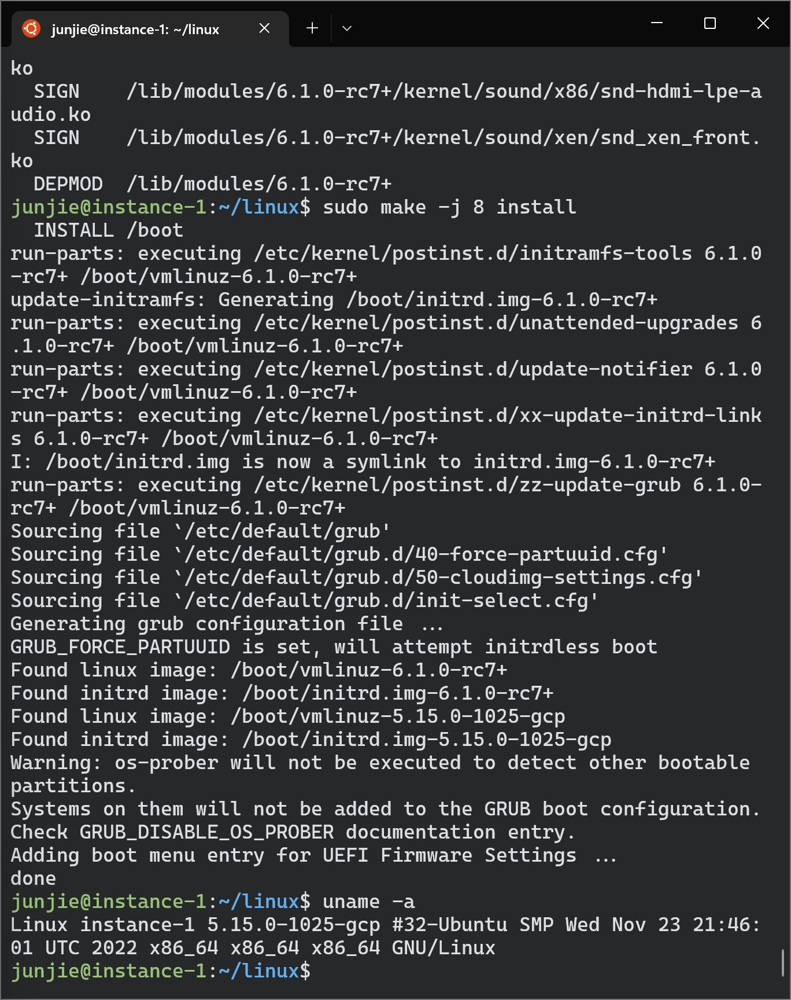
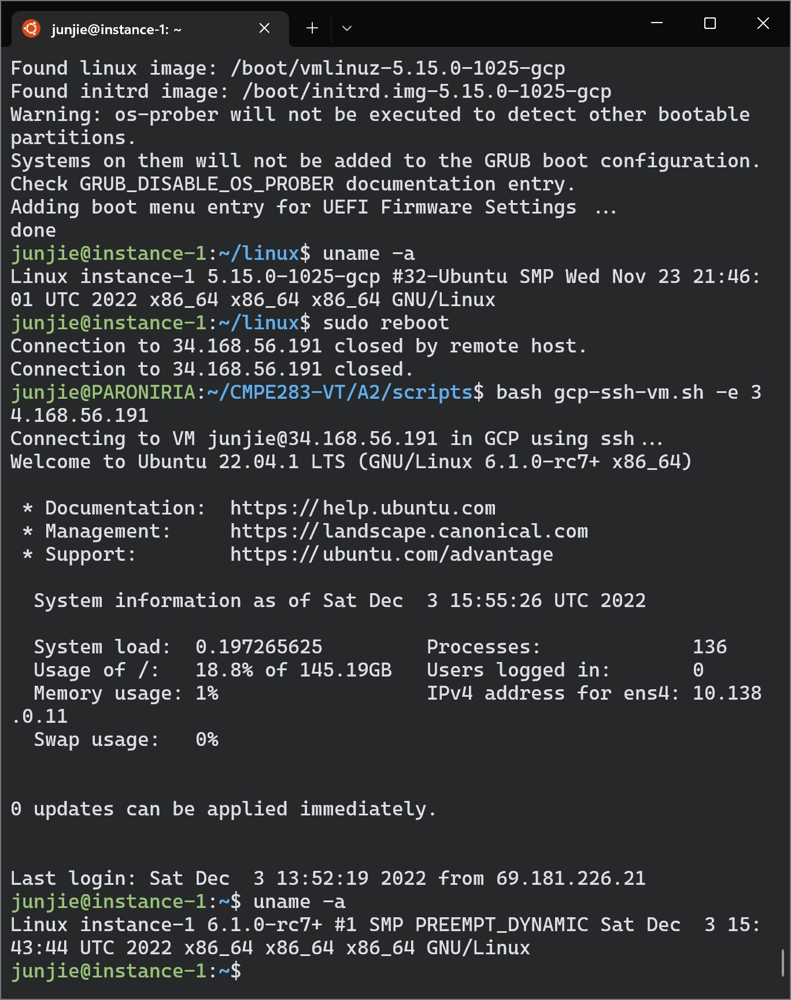
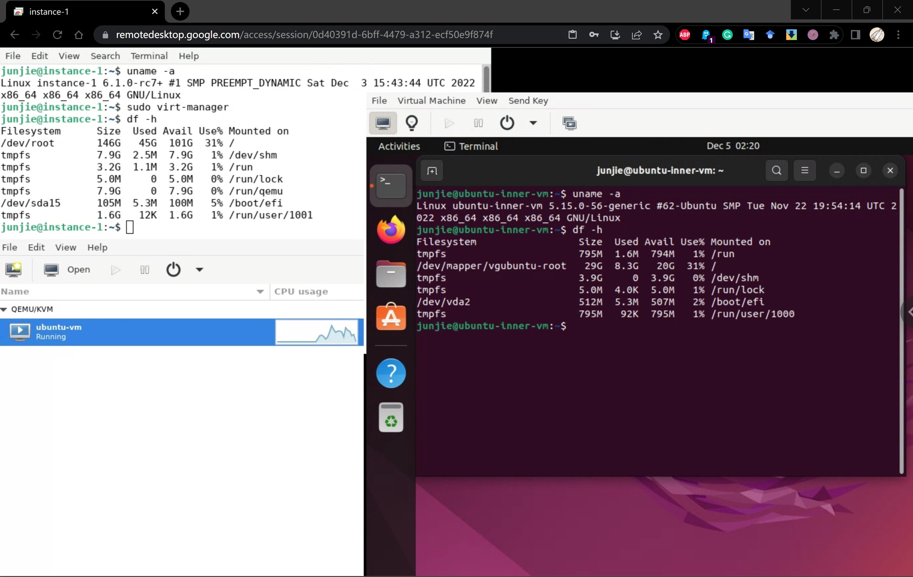
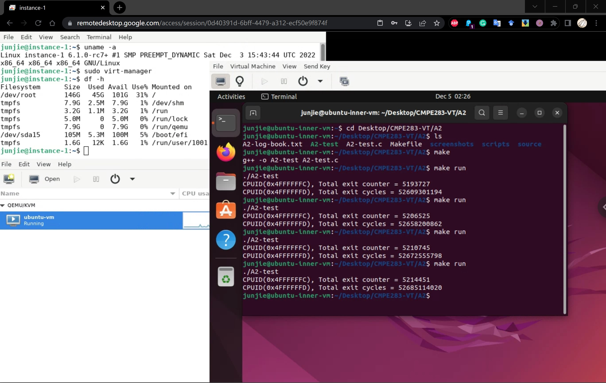

# Virtualization-Technologies

## CMPE 283 Virtualization Technologies Assignments

---

### Assignment 2: Instrumentation Via Hyper-call (Add New CPUID Emulation Features in KVM)

This assignment (A2) is to modify the CPUID emulation code in KVM to report back additional information
when special CPUID leaf nodes are requested:

* For CPUID leaf node %eax=0x4FFFFFFC:
  * Return the total number of exits (all types) in %eax

* For CPUID leaf node %eax=0x4FFFFFFD:
  * Return the high 32 bits of the total time spent processing all exits in %ebx 
  * Return the low 32 bits of the total time spent processing all exits in %ecx 
    * %ebx and %ecx return values are measured in processor cycles, across all VCPUs

At a high level, you will need to perform the following:
* Start with your assignment 1 environment 
* Modify the kernel code with the assignment(s) functionality:
  * Determine where to place the measurement code (for exit counts and # cycles)
  * Create new CPUID leaf 0x4FFFFFFD, 0x4FFFFFFC
    * Report back information as described above 
* Create a user-mode program that performs various CPUID instructions required to test your
assignment
  * Pro-tip: This can be achieved on ubuntu by installing the ‘cpuid’ package
  * Run this user mode program in the inner VM
    * There is no need to insmod anything like assignment 1 did
* Verify proper output

Refer to [A2 Instruction](source/283_Assignment2-3_F22.pdf) for detailed info and instructions in this assignment, and refer to my [A2 log-book](A2-log-book.txt) if you are blocked and needed help.

### A2 Result Demonstration
(check out [A2 screenshots](screenshots/) for more)

GCP-VM-L1-Original-Kernel-Info

GCP-VM-L1-Modified-Kernel-Info

GCP-VM-L2-Kernel-Info [Nested Virtualization]

GCP-VM-L2-A2-Test-Result
