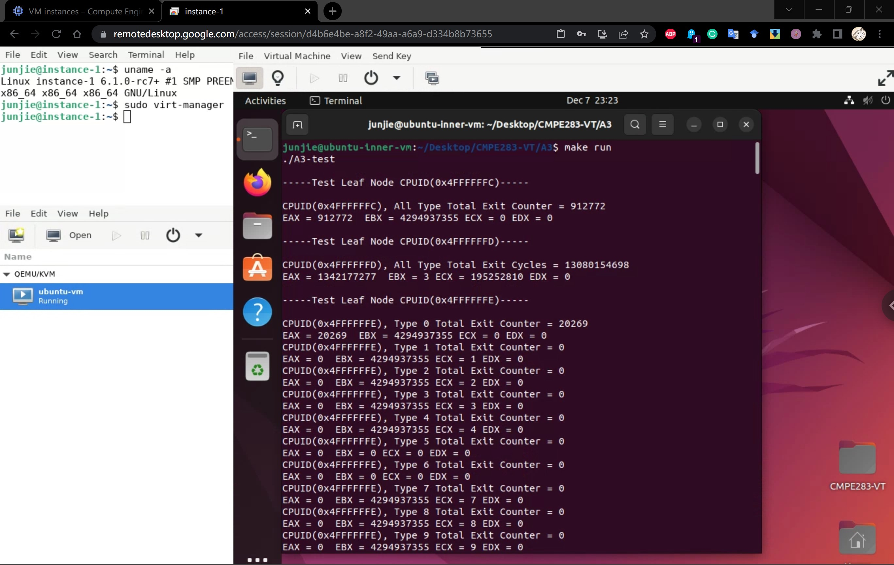
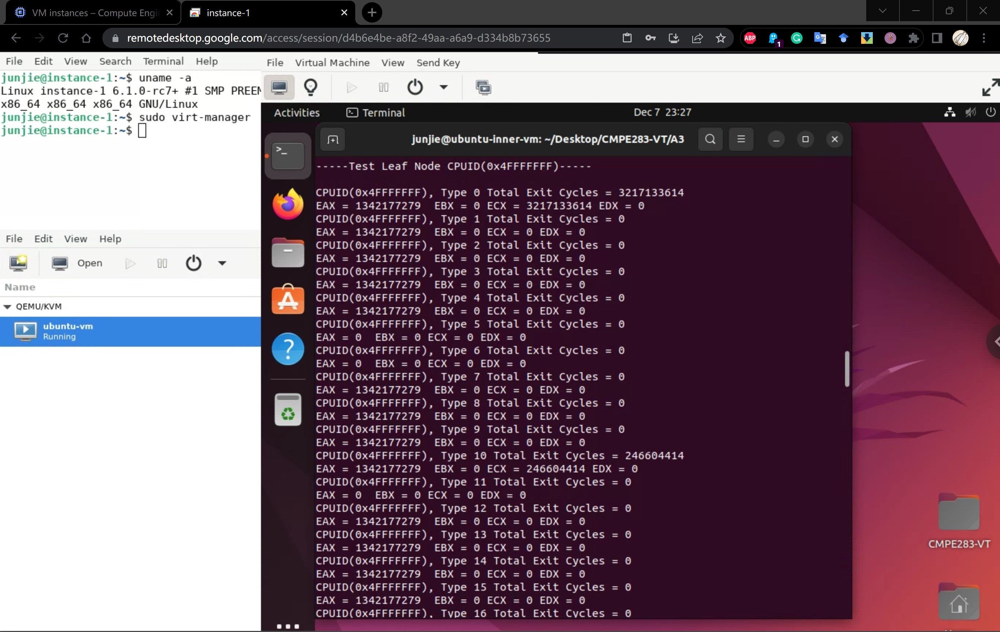
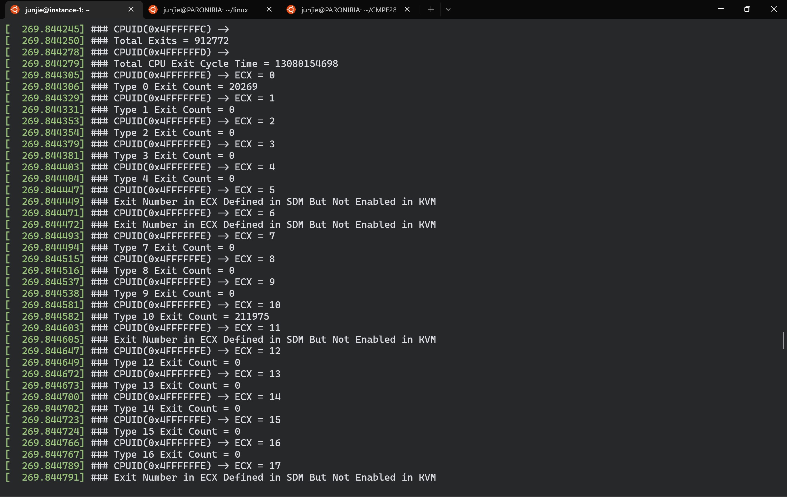
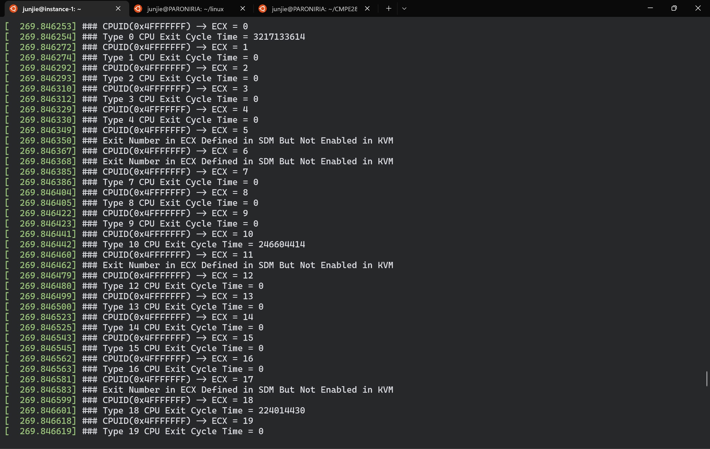

### Assignment 3: Instrumentation Via Hyper-call II (Add New CPUID Emulation Features in KVM)

This assignment (A3) is to modify the CPUID emulation code in KVM to report back additional information
when special CPUID leaf nodes are requested:

* For CPUID leaf node %eax=0x4FFFFFFE:
  * Return the number of exits for the exit number provided (on input) in %ecx
    * This value should be returned in %eax

* For CPUID leaf node %eax=0x4FFFFFFF:
  * Return the time spent processing the exit number provided (on input) in %ecx
    * Return the high 32 bits of the total time spent for that exit in %ebx
    * Return the low 32 bits of the total time spent for that exit in %ecx

At a high level, you will need to perform the following:
* Start with your assignment 2 environment

* Modify the kernel code with the assignment(s) functionality:
  * Determine where to place the measurement code (for exit counts and # cycles)
  * Create new CPUID leaf 0x4FFFFFFE, 0x4FFFFFFF
    * Report back information as described above

* Create a user-mode program that performs various CPUID instructions required to test your
  assignment
  * Pro-tip: This can be achieved on ubuntu by installing the ‘cpuid’ package
  * Run this user mode program in the inner VM
    * There is no need to insmod anything like assignment 1 did

* Verify proper output

Refer to [A3 Instruction](source/283_Assignment2-3_F22.pdf) for detailed info and instructions in this assignment, and refer to my [A3 log-book](A3-log-book.txt) if you are blocked and needed help.

### A3 Result Demonstration

(check out [A3 screenshots](screenshots/) for more)

GCP-VM-L2-A3-Test-Result-E-0

GCP-VM-L2-A3-Test-Result-F-0

VM-L2-A3-Test-Result-Statics-0

GCP-VM-L1-Demsg-For-A3-Test-E-0

GCP-VM-L1-Demsg-For-A3-Test-F-0

A3 Questions:

* Does the number of exits increase at a stable rate?
  * No, some of the exits increase, some of them stay the same. Among the ones that increase,
           they have different increment ratio depends on the exit type.

* Are there more exits performed during certain VM operations?
  * Yes, for example, EXIT_REASON_CPUID(10), EXIT_REASON_IO_INSTRUCTION(30), EXIT_REASON_MSR_READ(31), etc.

* Approximately how many exits does a full VM boot entail?
    * It entails total 912772 exits with total 13080154698 cycle times.
    
* Of the exit types defined in the SDM, which are the most frequent? Least?
  * EXIT_REASON_EPT_VIOLATION(48) happens the most frequent, EXIT_REASON_DR_ACCESS(29) happens the least frequent
  * Also, EXIT_REASON_MSR_READ(31) has the highest increment over time, EXIT_REASON_EPT_VIOLATION(48) has the lowest increment over time,

Please refer to my [A3 log-book](A3-log-book.txt) in step 47 to see a more detailed and comprehensive analyze. :D
